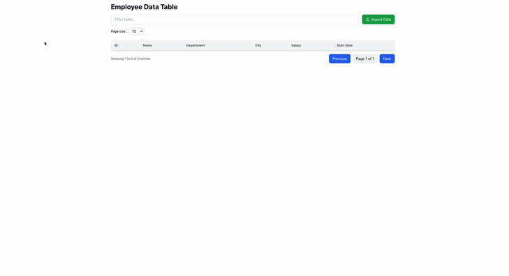
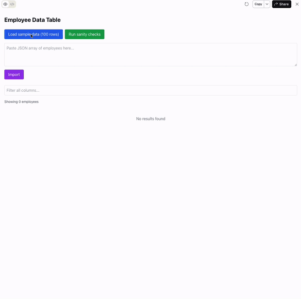

## Intro

**Deliverables:** This doc records each prompt version for Challenge 2 (React sortable/filterable/paginated table), test results for the generated code, what made the prompts better, and how the code quality compares across versions.

## v1
### Prompt
Write an interactive Artifact that renders a React table.
* Clicking a column header should sort the table, allow two sort at the same time, allow undo a sort.
* Add a text input to filter rows.
* Add pagination with next/previous buttons with configurable page size.
* Proper TypeScript types

Add a 'import to test' button where I can copy/paste bunch of employees information into this table to test. 
the data i will upload will be like this:
[
  { id: "E001", name: "Alex Chen", department: "Engineering", city: "Seattle", salary: 120000, startDate: "2022-06-01" },
    { id: "E003", name: "Mia Park", department: "Design", city: "San Francisco", salary: 98000, startDate: "2023-01-15" },
xxxxxxx
]

### Screenshot

### Test results

| Item | ✓ / ✗| Result |
|------|:--------:|--------|
| **Sort** | ✓ | Clicking header changes sort; first row order is correct. |
| **Filter** | ✓ | Typing a keyword reduces rows; remaining rows contain the keyword. |
| **Pagination** | ✓ | Next/Previous work; with 100 rows and 10 per page, 10 pages total, split is correct. |
| **Layout stability** | ✗ | When sorting, the table jumps and column width is not stable. |
| **Page size** | ✗ | Only preset options (e.g. 5/10); no custom number input. |
| **Page jump** | ✗ | Only prev/next buttons; cannot type a page number to jump. |
| **Empty state** | ✗ | No "no data" or empty-state message when there is no data. |
| **Component & types** | ✗ | Asked for TypeScript types but table does not take data via props; everything is internal `useState`, not reusable. |
| **Test coverage** | ✗ | Auto-generated tests are few and shallow; hard to tell if there are hidden bugs. |

## v2
### Prompt

You are a senior React + TypeScript engineer.

Task
Create an interactive Claude Artifact that renders a sortable + filterable + paginated table for Employee data.

Data model
Use:
type Employee = {
  id: string;
  name: string;
  department: string;
  city: string;
  salary: number;
  startDate: string; // YYYY-MM-DD
};

Requirements (focus on fixes, keep it simple)
1) Sorting
- Support multi-column sort up to 2 columns.
- Clicking a header cycles: none → asc → desc → none.
- Show an arrow indicator for sort direction.

2) Filtering
- One text input filters rows across all columns (case-insensitive).
- Reset to page 1 when filter changes.
- If no matches, show: “No results found”.

3) Pagination
- Prev/Next buttons.
- Add a page jump input (type a page number and go).
- Page size: keep preset dropdown (e.g., 5/10/20) AND add a numeric input for custom page size.

4) Layout stability
- Make table columns stable so the UI doesn’t jump when sorting/filtering.
  (Use a fixed table layout and set reasonable widths.)

Import-to-test
Add a textarea to paste JSON array of Employee objects and an Import button.
Show a clear error if JSON parsing fails.
Also include a button “Load sample data (100 rows)” that loads a built-in dataset.

Testing
Add a “Run sanity checks” button that does proper tests.assert checks for example:

- filtering “seattle” reduces results
- sorting salary asc yields non-decreasing salaries
- pagination pageSize=10 on 100 rows yields 10 pages

Output
Return one interactive Artifact only. Use TypeScript types and avoid `any`.
Keep the implementation straightforward

### Screenshot

### Test results

| Item | ✓ / ✗| Result |
|------|:--------:|--------|
| **Sort** | ✓ | Clicking header changes sort; first row order is correct. |
| **Filter** | ✓ | Typing a keyword reduces rows; remaining rows contain the keyword. |
| **Pagination** | ✓ | Next/Prev work; 100 rows, 10 per page gives 10 pages, split is correct. |
| **Layout stability** | ✓ | Table stays stable when sorting; column width does not jump. |
| **Page size** | △ | Preset and custom number input both work; but having both dropdown and input is confusing. |
| **Page jump** | △ | Can type a page number to jump; but invalid or out-of-range input gives no feedback or error. |
| **Empty state** | ✓ | Shows "No results found" when there is no data. |
| **Component & types** | △ | First version did not define props; only after I asked again in chat did it support passing data via props. |
| **Test coverage** | ✗ | Auto-generated tests only cover the 3 examples from the prompt; not deep. When data is empty, tests still say pass, which seems wrong. |

## v3
### Prompt
You are a senior React + TypeScript engineer designing a correct,
stable, and verifiable data table component.

<context>
This Artifact is meant to demonstrate production-minded UI logic:
clear data flow, predictable behavior, and visible verification.
The focus is not visual polish, but correctness and structure.
</context>

<task>
Create an interactive Claude Artifact that renders a sortable,
filterable, and paginated table for employee data.
</task>

<data_model>
Use proper TypeScript types, for example, this exact type:
type Employee = {
  id: string;
  name: string;
  department: string;
  city: string;
  salary: number;
  startDate: string; // YYYY-MM-DD
};
</data_model>

<component_structure>
- Implement a reusable table component that receives data via props.
- The Artifact may manage imported data at the top level,
  but the table itself must not hardcode its dataset.
</component_structure>

<sorting_requirements>
- Support multi-column sorting (up to 2 columns).
- Clicking a column header cycles: not sorted → ascending → descending → not sorted.
- Sorting must be stable:
  if two rows compare equal on all active sort keys,
  their original relative order must be preserved.
- Show sort direction and sort priority (1 / 2) in the header.
</sorting_requirements>

<filtering_requirements>
- Provide a single text input that filters rows across all visible columns.
- Filtering is case-insensitive.
- When the filter query changes, reset to page 1.
- If no rows match, display a clear empty state message:
  “No results found”.
</filtering_requirements>

<pagination_requirements>
- Provide:
  - Previous / Next buttons
  - A way to jump directly to a page number
- Page size must be configurable via:
  - a dropdown with preset values, AND
  - a numeric input that allows custom values (e.g. 7, 13).
- When page size changes, reset to page 1.
- Display total rows, filtered rows, and total pages.
</pagination_requirements>

<layout_stability>
- Prevent layout or column width shifts when sorting or filtering.
- Use a fixed table layout and fixed column widths.
</layout_stability>

<import_to_test>
Include an “Import to test” section with:
- A textarea where users can paste a JSON array of Employee objects
- An Import button that parses the JSON
- Graceful error handling if parsing fails
- Validation that each object contains all required Employee fields
- A “Load sample data (100 rows)” button for quick testing
</import_to_test>

<data_pipeline>
Implement and use typed pure helper functions:
1) filterRows(rows, query, columns)
2) sortRows(rows, sortState)
3) paginateRows(rows, page, pageSize)

Apply these steps in this exact order:
filter → sort → paginate
</data_pipeline>

<verification_testing>
Make two test buttons to check both Unit tests and End-to-end (E2E) tests, assert checks covering everything inside the test-doc.md file.
</verification_testing>

<output>
Return one interactive Artifact. Strict TypeScript typing, no `any`.
Keep UI clean; correctness should be demonstrated by tests + debug panel.
</output>

<debug_visibility>
At the bottom of the Artifact, display a compact debug panel showing:
- current filter query
- active sort keys, directions, and priority
- page number and page size
- total rows, filtered rows, total pages
- last user action (e.g. “sorted salary asc”, “imported 100 rows”)
</debug_visibility>

<output_constraints>
- Return one interactive Artifact only.
- Use strict TypeScript typing (no `any`).
- Keep comments concise and practical.
</output_constraints>

<planning>
Before writing any code, spend a moment to think or plan: outline the main components (e.g. data flow, table component, filter/sort/paginate pipeline, import validation, test harness), the order of implementation, and edge cases (empty data, invalid JSON, stable sort). 
</planning>

### Screenshot

### Test results

I wasn’t happy with how testing went in v1 and v2, and I felt like just asking Claude to generate tests wasn’t going to get much better. So this time I tried something different: I wrote down what to test using 100 rows of sample data, put it in `test-doc.md`, and uploaded that file with the prompt. I asked for both Unit and E2E tests—so we test both that the data is right and that user actions work. It worked well: in the gif you can see the E2E tests actually click and check what’s on screen, so pass/fail is clear. Below are the test items I used.

One small bug: when I set rows per page to something small (e.g. 1), there are really 100 pages, but the page numbers at the bottom only show up to 10 and don’t update. Probably something wrong with how the page numbers are rendered; should be easy to fix later.

#### Unit tests
Unit Tests: 15 / 15 ✓
✓ Total Records = 100
✓ First row is Alex Chen (E001)
✓ Salary Asc: Noah Johnson (70000) first
✓ Salary Desc: Priya Patel (135000) first
✓ Name A-Z: Adrian Brooks first
✓ Name A-Z: Zoë Kravitz last
✓ Date: Earliest is 2019-01-01
✓ Search "Chris Martin" = 1 record
✓ Search "Engineering" = 18 records
✓ Search "Seattle" filters by city
✓ Fuzzy match "Skylar" finds Skylar Stone
✓ Page 6 shows E051-E060
✓ Page 10 shows last 10 records
✓ Page size 25 = 4 total pages
✓ Special char "ë" in Zoë Kravitz renders

#### E2E tests
E2E Tests: 19 / 19 ✓
✓ Part 1: Verify initial state
First row shows Alex Chen (E001)
✓ Part 1: Check total records
Total count = 100
✓ Part 1: Check pagination buttons
Pages 1-10 generated
✓ Part 2: Click Salary header (ascending)
First row: Noah Johnson (Salary: $70,000)
✓ Part 2: Click Salary header again (descending)
First row: Priya Patel (Salary: $135,000)
✓ Part 2: Click Name header (A-Z)
First row: Adrian Brooks, Last row: Zoë Kravitz
✓ Part 2: Click startDate header (chronological)
First row has startDate: 2019-01-01
✓ Part 3: Search "Chris Martin"
Exactly 1 record returned
✓ Part 3: Clear search, then search "Engineering"
Filtered count = 18
✓ Part 3: Clear search, then search "Seattle"
All rows show city = Seattle
✓ Part 3: Clear search, then search "Skylar"
Matches Skylar Stone
✓ Part 3: Clear search box
Restore original 10 records
✓ Part 4: Click page 6
Show E051-E060
✓ Part 4: Click page 10
Show last 10 records, Next disabled
✓ Part 4: Change page size to 25
Total pages becomes 4
✓ Part 5: Reset, sort by Salary desc, then filter "Sales"
First row is highest-paid in Sales
✓ Part 5: Reset, filter for letter "e", check all pages
All entries contain "e"
✓ Part 5: Go to page 3, then change sort
Pagination resets to page 1
✓ Part 6: Verify special character rendering
Zoë Kravitz displays correctly

## What made prompts better

### v1 → v2

- **Role and constraints:** Saying "You are a senior React + TypeScript engineer" and "keep it simple" keeps the model on track and focused on getting things done, not showing off.
- **Data model first:** Give the `Employee` type (id, name, department, city, salary, startDate) before the requirements so the types and the code match.
- **Split requirements by feature:** Use 1) Sorting / 2) Filtering / 3) Pagination / 4) Layout stability, with sub-points under each (e.g. "Show an arrow indicator", "Reset to page 1 when filter changes") so it’s easy to implement and check one by one.
- **Spell out what to fix:** Put v1’s problems straight into the prompt: fixed table layout and stable column width; empty state shows "No results found"; page jump input; page size has presets plus custom number input.
- **Testing and validation:** Ask for a "Run sanity checks" button and give examples (filter "seattle", sort salary asc, pagination 10 pages) so the model writes real assertions; and say that Import should show a clear error when it fails.
- **Why we iterated:** v1 had UI jumping, no empty state, page size only presets, no page jump, no props. v2’s structured prompt fixed these one by one, so sort/filter/pagination and layout stability got much better.

### v2 → v3

- **Context and goal:** Say "production-minded", "correctness and structure", "focus is not visual polish" so the model cares more about getting things right and structured than fancy UI.
- **Ask for component structure clearly:** Say "reusable table component that receives data via props" and "table itself must not hardcode its dataset" so we fix v1/v2 not taking props and not being reusable.
- **Data pipeline and order:** Ask for pure functions `filterRows` / `sortRows` / `paginateRows` and the order "filter → sort → paginate" so behavior is predictable and easy to test.
- **Stable sort:** Say that when two rows are equal on all sort keys, their order must stay the same, and show sort priority (1/2) so multi-column sort doesn’t get messy.
- **External test doc:** Put test cases in `test-doc.md`, upload it with the prompt, and say "assert checks covering everything inside test-doc.md" and separate Unit vs E2E tests so coverage is repeatable and comparable.
- **Debug visibility:** Ask for a small debug panel at the bottom showing filter, sort state, page number, total rows, last user action so we can check by hand or with automation.
- **Why we iterated:** v2 still had no feedback on invalid page jump input and tests passing when data was empty. v3 used test-doc.md plus two test buttons plus debug panel, so 15 Unit + 19 E2E all pass; only a small bug remains (e.g. 100 pages but page numbers only show up to 10).

### Summary: what makes prompts more effective (for this challenge)

- **Spell out component/data boundaries in the prompt:** e.g. "table gets data via props", "don’t hardcode dataset", or the model tends to put everything in one file with state and it’s not reusable.
- **Be clear about data flow order:** e.g. "filter → sort → paginate" and the pure functions for each step, so there’s no hidden dependencies and it’s easier to test.
- **Mention layout/stability separately:** e.g. "fixed table layout", "fixed column widths", or the table often jumps when sorting/filtering.
- **Put test cases in a doc and point to it:** Write cases in a separate test-doc and say "cover everything in test-doc.md" in the prompt; that drives more complete and repeatable tests than just giving a few examples in the prompt.
- **Verification and visibility:** A debug panel showing last action, filter/sort state, etc. makes it much easier to check if things really work as expected.

## Code quality comparison

| Dimension | v1 | v2 | v3 |
|-----------|----|----|-----|
| **Component & types** | Has `Employee` interface but no props; everything is internal `useState`, not reusable | Defines `EmployeeTableProps` (initialData, defaultPageSize, showImportControls, etc.), supports props | Same as v2; table strictly gets data via props; types like `SortState` / `TestResult` / `E2EStep` are complete |
| **Data flow** | One useMemo: filter → sort, then slice for pagination; logic all mixed together | Logic still in component but clearer; has customPageSize, pageJump, etc. | Pure functions `filterRows` / `sortRows` / `paginateRows`, strict filter → sort → paginate pipeline, easy to unit test |
| **Layout stability** | No fixed column width; when sorting/filtering the table width changes and UI jumps | Asks for fixed table layout and column width; UI stable when sorting | Same as v2; column width and layout stable |
| **Sort** | Two-column sort; click cycles asc → desc → remove; shows priority | Same, up to 2 columns | Same, plus stable sort (equal rows keep order); header shows priority 1/2 |
| **Pagination** | Only Prev/Next; page size only preset dropdown | Prev/Next + page jump input; page size preset + custom input (UI a bit confusing) | Same as v2; shows total rows, filtered rows, total pages; invalid page jump could add validation later |
| **Empty state** | No "no data" message | Has "No results found" | Same as v2 |
| **Import / tests** | Has Import area; simple test button, few and shallow tests | Import + error message; Load sample 100 rows; Run sanity checks with 3 examples | Import + field validation; Load sample matches test-doc data; Unit 15 + E2E 19, cover test-doc.md; debug panel at bottom |
| **Code size** | ~435 lines | ~415 lines | ~1075 lines (lots of tests and debug UI) |

**Conclusion:** v1 is good for a quick check that sort/filter/pagination work. v2 is much better on layout, pagination, empty state, and props and works as a full version. v3 meets the assignment on reusability (props + pure function pipeline) and verifiability (test-doc + Unit/E2E + debug panel); the extra code is mostly tests and visibility, and it’s a good final version to hand in.

## Test results summary

| Version | Sort/Filter/Pagination | Layout stable | Empty state | Page size / Jump | Component props | Test coverage & verifiable |
|---------|------------------------|---------------|-------------|------------------|-----------------|----------------------------|
| v1 | ✓ Works | ✗ UI jumps | ✗ No message | ✗ Preset only; only prev/next | ✗ No props | Auto-generated tests shallow, few cases |
| v2 | ✓ | ✓ | ✓ "No results found" | ✓ Preset + input; can jump (no feedback on invalid input) | Only after asking again in chat | Only 3 sanity checks; empty data still says pass |
| v3 | ✓ | ✓ | ✓ | ✓ (small bug: page numbers cap at 10) | ✓ Table gets props, data pipeline clear | ✓ Unit 15/15 + E2E 19/19, cover test-doc.md; has debug panel |