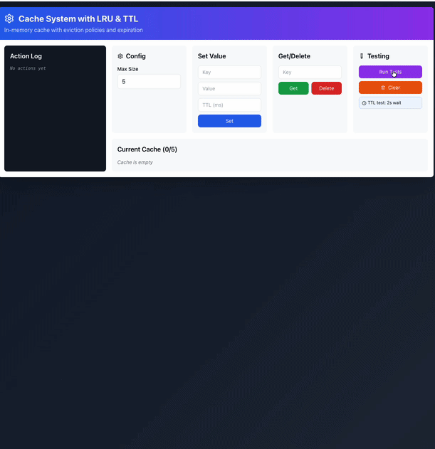
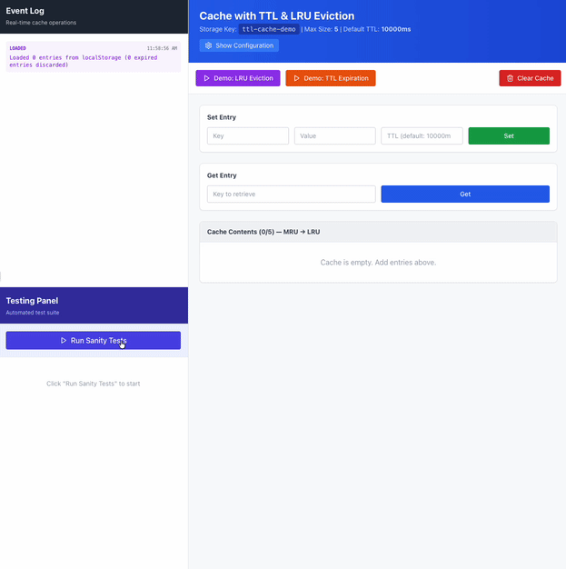
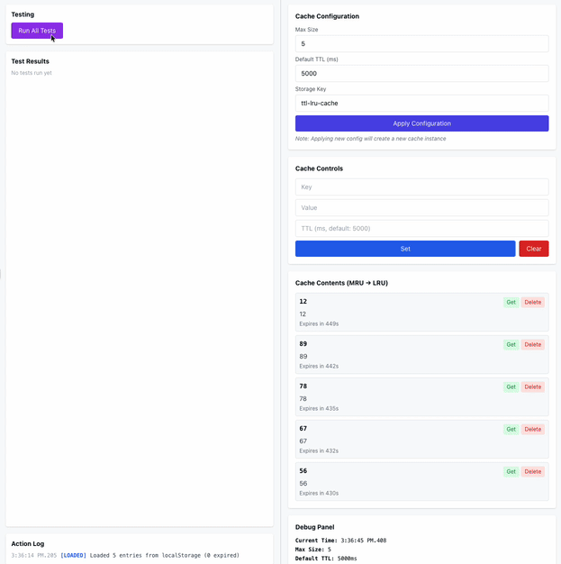

## Intro

Challenge 3: Caching layer with TTL, LRU eviction, persistence

Task: Build a cache with TTL (expiry), LRU eviction, and persistence.

Requirements: Entries expire by TTL; when the cache is full, evict the least recently used; persist to localStorage; configurable maxSize.

Deliverables: This file records v1 / v2 / v3 prompt iterations, test results, what made the prompts better, and code quality comparison.


## v1
### Prompt
Create an interactive Claude Artifact (React + TypeScript) that implements a caching layer.
Requirements
- Cache stores key-value pairs (keys are strings, values are strings for simplicity).
- Support TTL (time-to-live): set(key, value, ttlMs?) and get(key).
  Expired entries should not be returned.
- Support LRU eviction when the cache is full:
  configurable max size; when adding beyond maxSize, evict the least recently used entry.
- Persistence: save cache contents to localStorage, and load from localStorage on startup.
- Provide a simple UI:
  inputs for key, value, ttlMs, maxSize
  buttons: Set, Get, Delete, Clear
  display current cache entries and a log of actions/events.
- Include a testing section in the Artifact.
Testing requirements:
    - Add a small set of manual or scripted test buttons (or actions) that demonstrate basic set/get/delete/clear behavior
    - Tests may rely on simple logs or messages shown in the UI.
    - It is acceptable if some tests require real-time waiting (e.g., wait a few seconds for TTL).

### Follow-up prompt for extra testing from test-doc.md
Don't change any of the code's existing code logic.  Add testing to test the items in test-doc.md

### Screenshot



### Test result
I added tests with a follow-up after the initial artifact so I could run tests without changing the first version’s logic. It did not go well. The prompt said to use localStorage but it was never actually used, so all Group D persistence tests could not run. test-doc has 20+ cases (18 without Group D), but the artifact only had 13 tests, so it did not fully match the test spec. Also, the page did not refresh by itself: e.g. if I set an entry with 2s TTL, the UI would not show “expired” after 2 seconds until I did another action (e.g. another set) to trigger a redraw.

Sample log output:

```
[11:35:19 AM] TEST:✓ C4 passed (b evicted, a kept)
[11:35:19 AM] TEST:C6: eviction removes exactly one
[11:35:19 AM] CLEAR:Cache cleared
[11:35:19 AM] SET:key0 = "val0"
...
[11:35:19 AM] TEST:=== Test Summary ===
[11:35:19 AM] TEST:Total: 13 tests | Passed: 11 | Failed: 2
[11:35:19 AM] TEST:Failed tests: A5, C1
[11:35:19 AM] TEST:Note: Persistence tests (Group D) require localStorage which is not available in artifacts
[11:35:34 AM] ERROR:Key cannot be empty
```

## v2
### Prompt
You are an experienced TypeScript engineer.

Context
This is a prompt-iteration assignment. The goal is to make the cache behavior explicit and easy to verify.

Task
Build an interactive Claude Artifact (React + TypeScript) implementing a cache with TTL, LRU eviction, and persistence to localStorage.

Data model
- Keys: string
- Values: string
- Each entry stores:
  value: string
  expiresAt: number (milliseconds timestamp)
  lastAccessAt: number (for debugging/visibility)

Configuration (must be user-configurable in UI)
- maxSize: number
- defaultTTLms: number
- storageKey: string (fixed default is fine, but show it)

Behavior rules (must follow exactly)
1) TTL
- set(key, value, ttlMs?) uses ttlMs if provided, otherwise uses defaultTTLms.
- get(key):
  - if key does not exist, return undefined and log "miss"
  - if expired, remove it, return undefined, log "expired"
  - if not expired, return value and log "hit"
- set(...) should also perform a cleanup pass that removes any expired entries first.

2) LRU
- “Use” includes both set(key,...) and get(key).
- When an entry is used, it becomes the most recently used (MRU).
- If inserting a new entry causes size > maxSize, evict the least recently used (LRU) entry.
- Log evictions with the evicted key.

3) Persistence
- After any mutation (set/delete/clear), persist to localStorage under storageKey.
- On initialization, load from localStorage:
  - If JSON is invalid/corrupted, start with an empty cache and log an error message (do not crash).
  - Discard expired entries on load.

UI requirements (for verification)
- Show cache contents ordered from MRU → LRU.
- Show for each entry: key, value, expiresAt (human readable), and whether it is currently expired.
- Show an event log panel capturing: hit/miss/expired/evicted/saved/loaded/parse-error.
- Use the full available width of the Artifact (no centered narrow container).
- Arrange the UI so that the action/event log is placed on the left side,
  with the main cache/table controls and content on the right
- Add buttons:
  - "Load sample scenario: LRU" (runs a scripted sequence demonstrating eviction)
  - "Load sample scenario: TTL" (runs a scripted sequence demonstrating expiry using real time OR a clear note to wait)

Output
Return one interactive Artifact. Use TypeScript strictly (no any). Keep code readable and well-commented.
### Follow-up prompt for extra testing from test-doc.md
Don’t change any of the existing cache logic, algorithms, or behavior.
This includes: TTL rules, LRU rules, persistence logic, and any existing data structures.
Do NOT refactor, rename, or reorganize existing functions/classes/state.
Only ADD new code for testing and minimal UI wiring to trigger tests.

Add a Testing section to the Artifact that reads and implements the test cases described in test-doc.md.

Requirements for the new Testing section (v2):
- Add a “Run sanity tests” button.
- Implement the tests using console.assert (or equivalent) and also show a simple pass/fail summary in the UI.
- Tests must cover at least:
  1) Basic operations: set/get/delete/clear
  2) LRU eviction when maxSize is exceeded
  3) Persistence: after set/delete/clear, localStorage has updated data; and loading restores non-expired entries
  4) TTL: include at least one expiry test (real-time waiting is acceptable in v2 if needed)

Constraints:
- If any test requires waiting for TTL, keep it short and clearly show progress (e.g., “waiting 1s…”).
- If a test fails, DO NOT fix the cache logic. Only report the failure in the test results panel.

Deliverable:
- A dedicated “Testing” panel in the UI
- A readable list of test names with PASS/FAIL
- Console output that includes failing assertions

### Screenshot



### Test result
localStorage worked this time: after I added entries and refreshed the page, the data was still there, which was what I wanted. All 22 test-doc cases passed. Two downsides: (1) Expired state still did not show right away—same as v1, you had to do another action to see the update. (2) The UI got worse: the left event log had no max height, so when there was a lot of content the whole page got very long; the first artifact did not have this, so adding test-doc tests did not keep the layout in mind. After running tests, the log shows one localStorage parse-error. It is expected: D4 intentionally writes invalid JSON to test “corrupted storage handled safely,” and the cache correctly detects it and logs it. So it is not a bug in the cache logic. But the behavior is still not ideal—having a parse-error in the main log after tests is confusing. It can isolate D4 (e.g. uses a separate storage key for the test or restores/clears after the test) so the main app log is not polluted. That would be a better approach for v2.

**Event log (excerpt)** — includes set / saved / evicted / expired / parse-error etc.:

```
parse-error  12:01:04 PM  Failed to load from storage (SyntaxError: ... "invalid{json}data" is not valid JSON), starting fresh
loaded       12:01:04 PM  Loaded 0 entries from localStorage (1 expired entries discarded)
saved        12:01:03 PM  Persisted 1 entries to localStorage
set          12:01:03 PM  Set key: A, TTL: 500ms
...
expired      12:01:01 PM  Key expired and removed: a
```

**Test summary:** Passed 22 / Failed 0 / Total 22

- ✓ A: A1: set + get basic
- ✓ A: A2: overwrite existing key
- ✓ A: A3: delete removes key
- ✓ A: A4: clear empties cache
- ✓ A: A5: size reflects entries
- ✓ B: B1: TTL not expired yet
- ✓ B: B2: TTL expired
- ✓ B: B3: expired entry removed on get
- ✓ B: B4: expired entry removed on set cleanup
- ✓ B: B5: defaultTTL used when ttlMs not provided
- ✓ B: B6: custom ttl overrides defaultTTL
- ✓ C: C1: no eviction when under capacity
- ✓ C: C2: evict LRU on overflow
- ✓ C: C3: get refreshes recency
- ✓ C: C4: set refreshes recency
- ✓ C: C5: LRU order visible (MRU first)
- ✓ C: C6: eviction removes exactly one entry
- ✓ C: C7: expired key not counted in LRU
- ✓ D: D1: persist after set
- ✓ D: D2: load restores non-expired entries
- ✓ D: D3: expired entries not restored
- ✓ D: D4: corrupted storage handled safely

## v3
### Prompt
You are an experienced TypeScript engineer focused on correctness and verifiability.

<context>
This Artifact must demonstrate a cache with TTL, LRU eviction, and persistence.
The system should be easy to observe and verify, including time-based behavior.
</context>

<task>
Create an interactive Claude Artifact (React + TypeScript) implementing a cache with:
- TTL (time-to-live) per entry
- Least Recently Used (LRU) eviction when full
- Persistence to localStorage
- Configurable maxSize, defaultTTLms, and storageKey
</task>

<rules>
1) TTL
- Each entry has an expiresAt timestamp based on real time (Date.now).
- get(key):
  - returns undefined and removes the entry if expired
  - returns the value if not expired
- set(key, value, ttlMs?):
  - uses ttlMs if provided, otherwise defaultTTLms
  - performs cleanup of expired entries before inserting

2) LRU
- “Use” includes both get and set.
- Most recently used entries should appear first in display order (MRU → LRU).
- When inserting causes size > maxSize, evict exactly one LRU entry and log the eviction.

3) Persistence
- Persist cache state to localStorage after set, delete, or clear.
- On initialization:
  - load from localStorage
  - discard expired entries
  - handle corrupted JSON safely (do not crash, log a parse-error)
</rules>

<implementation>
- Use Map to maintain LRU ordering with O(1) updates.
- Store entries as:
  { value: string; expiresAt: number }
</implementation>

<time_driven_ui>
- Cache state can change over time due to TTL expiration.
- The UI must automatically reflect these time-based changes without requiring user actions.
- Implement a lightweight periodic refresh (e.g., setInterval every ~300–500ms)
  that re-evaluates expiration and updates the displayed cache state and logs.
- Use a single time source (Date.now) consistently across cache logic and UI.
</time_driven_ui>

<verification_ui>
- Display cache entries ordered from MRU → LRU.
- For each entry, show key, value, and expiration status.
- Include an action/event log showing:
  hit / miss / expired / evicted / saved / loaded / parse-error
- Include a debug panel showing:
  - current time
  - maxSize, defaultTTLms, storageKey
  - cache size
  - keys in MRU → LRU order
  - last action
</verification_ui>

<testing_support>
- Include a Testing section with a “Run Tests” button.
- Tests should exercise TTL, LRU, persistence, and maxSize behavior.
- TTL-related tests may use short TTL values (e.g., 200–1000ms) and async waiting.
- Test results should be clearly reported as PASS/FAIL without modifying cache logic.
</testing_support>

<ui_layout>
- Use the full available width of the Artifact.
- Use a two-column layout:
  - Left panel: action log and test output (scrollable).
  - Right panel: cache controls, cache contents, and debug panel.
- The layout should fit within one screen without horizontal scrolling.
</ui_layout>

<output_constraints>
- Return one interactive Artifact only.
- Use strict TypeScript types (no any).
- Keep comments concise and focused on behavior.
</output_constraints>

<planning>
Before writing any code, spend a moment to think or plan: outline the main components (e.g. cache class, React state, persistence layer, UI refresh), the order of implementation, and edge cases (expiry on load, eviction, corrupted storage).
</planning>

**Note:** v3’s prompt uses XML-style tags (`<context>`, `<task>`, `<rules>`, `<implementation>`, `<time_driven_ui>`, `<verification_ui>`, etc.) to split the prompt into sections, so the model can tell apart “role/task”, “behavior rules”, “implementation”, “UI and verification”, and so on, and is less likely to miss or mix up parts.

### Screenshot



### Follow-up prompt for extra testing from test-doc.md
Do NOT change any existing cache logic, algorithms, or behavior.
No refactors, no renaming, no restructuring of the cache implementation.

Task
Add a comprehensive Testing section to the Artifact that:
1) Reads the test cases defined in `test-doc.md`
2) Maps each test case to an executable test
3) Runs all tests and reports their results (PASS / FAIL)
Testing execution requirements
- Implement a “Run All Tests” button.
- When clicked, the Artifact must:
  - Execute the 22 tests defined in `test-doc.md` sequentially
  - For each test, display:
    - test name / identifier
    - expected behavior
    - observed result
    - PASS or FAIL
- Display a summary:
  - total tests
  - passed
  - failed

Constraints
- If any test fails:
  - DO NOT change cache logic to make it pass
  - Simply report the failure accurately
- Only adjust the testing harness if a test from `test-doc.md`
  was implemented incorrectly.

UI requirements for testing
- Place the Testing section and test report in the left-side log panel.
- Ensure all test results are visible without horizontal scrolling.
- Test output should update automatically as time advances in tests.

### Test result
v3 fixed the issues from v1 and v2: TTL entries expire over time and the UI refreshes on a timer, so you do not have to trigger it by hand; LRU eviction, localStorage persistence, maxSize and other config all work as expected. All 22 tests passed, and the real-time expiry and layout (scrollable log area, fits on one screen) match what the prompt asked for.

**Summary:** Total 22, Passed 22, Failed 0

**Test Results** (all PASS, Expected / Observed match):

```
A1: set + get basic                    — PASS  Expected: "1", Observed: "1"
A2: overwrite existing key             — PASS  Expected: "2", Observed: "2"
A3: delete removes key                 — PASS  Expected: undefined, Observed: undefined
A4: clear empties cache                — PASS  Expected: both undefined, Observed: a=undefined, b=undefined
A5: size reflects entries              — PASS  Expected: 2, Observed: 2
B1: TTL not expired yet                 — PASS  Expected: "1", Observed: "1"
B2: TTL expired                         — PASS  Expected: undefined, Observed: undefined
B3: expired entry removed on get        — PASS  Expected: size=0, Observed: size=0
B4: expired entry removed on set cleanup — PASS  Expected: a not in cache, Observed: a not found
B5: defaultTTL used when ttlMs not provided — PASS  Expected: undefined, Observed: undefined
B6: custom ttl overrides defaultTTL    — PASS  Expected: undefined, Observed: undefined
C1: no eviction when under capacity     — PASS  Expected: size=2, Observed: size=2
C2: evict LRU on overflow               — PASS  Expected: a not in cache, Observed: a not found
C3: get refreshes recency               — PASS  Expected: b evicted a retained, Observed: a=found b=not found
C4: set refreshes recency               — PASS  Expected: b evicted a retained, Observed: a=found b=not found
C5: LRU order visible (MRU→LRU)        — PASS  Expected: a, b, Observed: a, b
C6: eviction removes exactly one entry  — PASS  Expected: size=3, Observed: size=3
C7: LRU respects get on expired key     — PASS  Expected: size=3 (a not counted), Observed: size=3
D1: persist after set                   — PASS  Expected: localStorage contains data, Observed: data found
D2: load restores non-expired entries   — PASS  Expected: both values restored, Observed: a=1, b=2
D3: expired entries not restored        — PASS  Expected: undefined, Observed: undefined
D4: corrupted storage handled safely   — PASS  Expected: no crash empty cache, Observed: no crash size=0
```


## What Made the Prompts Better (Prompt Iteration Notes)

| Iteration | Change | Effect |
|-----------|--------|--------|
| **v1 → v2** | **Clear data model:** Ask for each entry to have `expiresAt`, `lastAccessAt`, and for config (maxSize, defaultTTLms, storageKey) to be configurable in the UI. | Model is clearer and behavior is predictable; v2 actually used localStorage. |
| **v1 → v2** | **Structured behavior rules:** Numbered Behavior rules for TTL, LRU, Persistence (get/set/cleanup/load). | Output matched the spec; all 22 tests passed. |
| **v1 → v2** | **UI and verification:** Specify MRU→LRU order, show per-entry expiry, event types (hit/miss/expired/evicted/saved/loaded/parse-error), left–right layout. | Easier to check by hand and debug; but v2 did not limit log height, so long logs stretched the page. |
| **v2 → v3** | **Time-driven UI:** Say clearly that TTL changes must show in the UI without user action, and use a timer (e.g. setInterval 300–500ms). | Fixed “expired not updating until next action”; behavior matches what we wanted. |
| **v2 → v3** | **Implementation:** Use Map for LRU order, entry only `{ value, expiresAt }`, single time source Date.now. | Shorter code, LRU via Map order, easier to read and change. |
| **v2 → v3** | **Verification / debug:** Add verification_ui and debug panel (current time, config, size, MRU→LRU keys, last action). | Easier to see what is going on and find bugs. |
| **v2 → v3** | **Layout:** Say “one screen, no horizontal scroll, left log scrollable”. | Avoids v2’s problem where the log made the page very long. |
| **v2 → v3** | **Planning:** Ask to plan components, order of implementation, and edge cases before coding. | Helps get persistence, expiry, bad JSON right in one go. |
| **v2 → v3** | **XML tags:** Use `<context>`, `<task>`, `<rules>`, `<time_driven_ui>`, `<verification_ui>` etc. to split the prompt. | Model can parse each part and follow the right rules; less missing or mixing up. |

**Summary:** Writing down “data model + behavior rules + UI/verification + implementation + time/layout” clearly, and using XML or similar to split the prompt, plus fixing the issues we saw in v1/v2 (no persistence, no auto refresh, log stretching the page) in the next prompt, made the generated code more correct and easier to maintain.


## Code Quality Comparison Across Versions

| Aspect | v1 | v2 | v3 |
|--------|----|----|-----|
| **Architecture** | Only React state (useState + Map), logic and UI mixed in one component. | Separate `TTLCache` class, config and logCallback passed in, clearer roles. | Separate `TTLLRUCache` class, similar to v2 but entry type is simpler. |
| **Data model** | `CacheEntry`: value, expiry (null = no expiry), lastAccessed. | `CacheEntry`: value, expiresAt, lastAccessAt; plus `CacheConfig`. | `CacheEntry`: only value, expiresAt; no lastAccessAt, LRU order comes from Map order. |
| **LRU** | Loop over Map to find smallest lastAccessed then delete. | Map keeps order but entry still has lastAccessAt. | Map order: on get/set, delete then set to move key to “newest”, O(1). |
| **Persistence** | localStorage not really used (artifact limit), Group D tests could not run. | Reads/writes localStorage correctly; on load drops expired and handles bad JSON safely. | Same as v2; persistence is solid. |
| **Time and UI** | No timer; after expiry you had to do something to see the update. | Same as v1; expiry did not auto-refresh. | setInterval checks expiry and updates state; UI shows TTL updates by itself. |
| **Types and readability** | Has interfaces but logic spread over many handlers. | Full types (CacheConfig, LogEvent, TestResult, etc.), sections (Types / Cache / UI). | Types are simple, no any; short methods, one job per method. |
| **Test coverage** | Only 13 tests, no Group D; A5 and C1 failed. | All 22 pass; tests match test-doc.md. | All 22 pass and show expected/observed; easier to read. |
| **UI layout** | Simple form + log, log capped at last 20 lines. | Log on left, content on right, but log has no max height so long log stretches the page. | Left: log and tests (scrollable); right: content and debug panel; one screen, no horizontal scroll. |

**Conclusion:** v3 is better than v1 and v2 on correctness (persistence, TTL auto-refresh), LRU (O(1) with Map), observability (debug + event log), layout, and test readability. v2 improved on v1 mainly by adding persistence and full test coverage; v3 then added time-driven UI and layout limits and simplified the data model and LRU implementation.